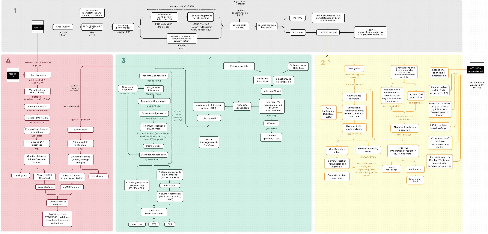

# Klebsiella pneumoniae bioinformatics

Scripts and data for Klebsiella pneunmoniae analysis of Greek isolates in _The evolution of carbapenem-resistant Klebsiella pneumoniae in Greek intensive care units is driven by local carbapenemase acquisition, nationwide nosocomial spread and emerging resistance to novel antimicrobials. Baltas et.al. 2026_ 

Pipeline:

Module 1. Genome Assembly (For each sample in Clonal Groups)

Module 2. AMR gene detection (per gene)

Module 3. Core-genome phylogenomics and molecular dating (By cluster)

Module 4. Transmission inference (By cluster)
